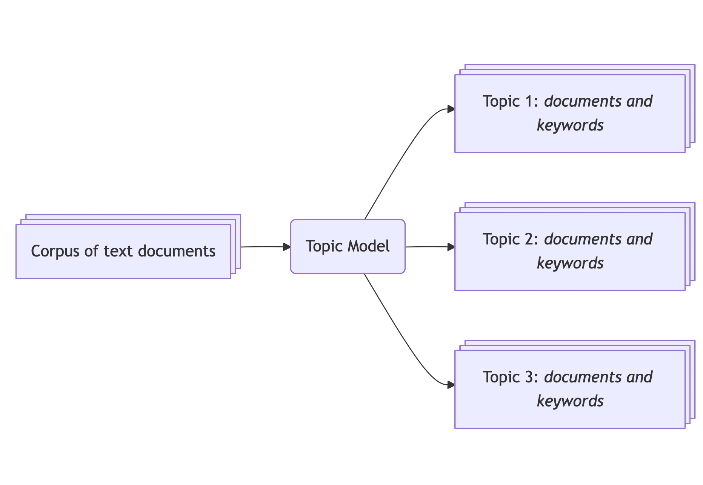
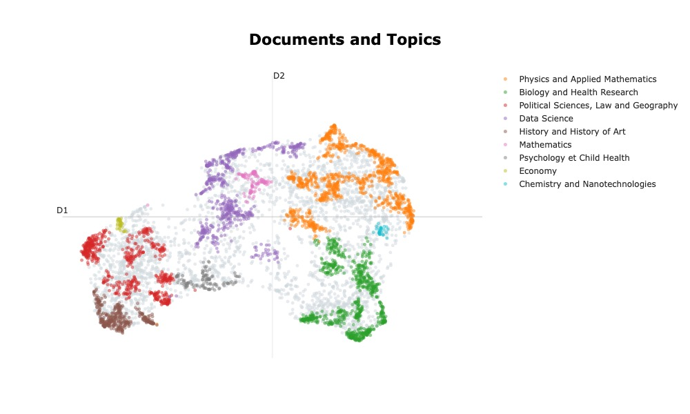
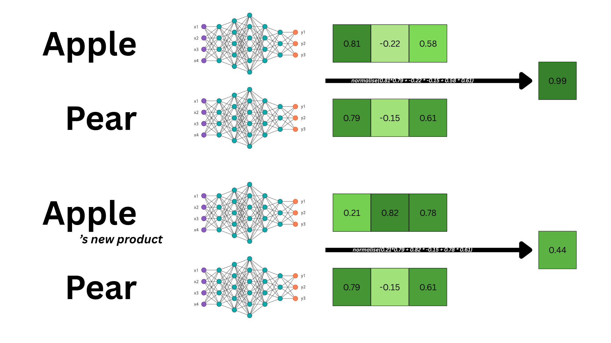

# Explorer et classifier les thèmes d'un corpus de textes avec BERTopic et Python

## Intro

### Objectifs de la leçon 

- Introduction aux méthodes de topic modelling: Quelles méthodes existent ? Pour quelles tâches ? Dans quels contextes ?
- Introduire les concepts structurants de la librairie, et illustrer son utilisation
- Illustrer les commandes et visualisations principales
- Sensibiliser aux bonnes pratiques pour faciliter la reproductibilité et l'usage des modèles de langue.

### Prérequis 

Ce tutoriel requiert d'avoir une certaine aisance avec Python. Par exemple, nous n'expliquons pas : 

- Comment initialiser son environnement et installer des paquets
- Les syntaxes de base de Python (fonctions, variables, conditions, loupes "for") ni les manipulations Pandas de base comme l'ouverture de fichier ou les traitements usuels de création, suppression de colonnes ou lignes.

Ce tutoriel aborde des notions de NLP de base (modèles de plongement, similarité sémantique) et nous faisons appel à des notions de Machine Learning (clustering, réduction de dimensionalité). Ce tutoriel présente comment les concepts s'articulent entre eux mais nous ne redéfinissons pas individuellement chaque terme. Nous renvoyons vers de nombreuses sources qui font ce travail.

<!-- TODO: Proposer des lectures avant de se lancer -->

# Matériel disponible, et environnement virtuel 

Dans le cadre de ce tutoriel, nous mettons a disposition plusieurs fichiers sur la plateforme [Zenodo](https://zenodo.org/records/17936091). Vous y trouverez: 

- Le jeux de données complet nettoyé[^info-nettoyage] (700 Mo): La procédure de nettoyage des données est renseignée [ici (written in English)](https://css-polytechnique.github.io/css-ipp-materials/pages/techy-notes.html#curations-of-the-original-dataset).
- Un extrait stratifié du jeu de données[^info-stratification] (30 Mo): Pour chaque année, nous avons tiré 500 lignes. En tout, le jeu de données contient 6500 lignes.
- Un ensemble de jeux de plongements : En tout nous proposons 9 jeux de plongements pour 3 modèles différents ([Alibaba-NLP/gte-multilingual-base](https://huggingface.co/Alibaba-NLP/gte-multilingual-base), [sentence-transformers/all-MiniLM-L6-v2](https://huggingface.co/sentence-transformers/all-MiniLM-L6-v2), [Qwen/Qwen3-0.6B](https://huggingface.co/Qwen/Qwen3-0.6B)), deux langues (anglais, français) et deux techniques de génération (pipeline Huggingface ou SBERT). Ces jeux de données permettent d'explorer les variations de résultats selon les modifications décrites.

:::{.callout-info}

Ces données ont été rendues disponibles dans le cadre de la publication de ce tutoriel [The General Inquirer in the time of LLMs: a BERTopic tutorial](https://css-polytechnique.github.io/css-ipp-materials/pages/bertopic-tutorial.html) en anglais, dont le présent tutoriel est une traduction.

:::

Pour préparer votre espace Python, nous conseillons les versions suivantes: 

```txt
bertopic==0.17.3
datasets==4.3.0
hdbscan==0.8.40
numpy==2.3.5
pandas==2.3.3
plotly==6.3.1
scikit_learn==1.8.0
stopwordsiso==0.6.1
transformers==4.52.4
umap_learn==0.5.7
```

## Le topic modelling, une tâche répendue en sciences sociales

- accroche: 
    - What are the main issues addressed in a set of documents? Are those documents similar or discussing different matters? What is the most important topic? Delineating the main themes in a collection of documents is a common task in social sciences, particularly when exploring a new corpus.
- Histoire du topic modelling
    - Pendant longtemps ça s'est fait avec des LDAs + décrire le but + donner des sources et décrire leur recherche
    - D'autres méthodes existent: Mentionner le NMF et LSA, Top2Vec ([ref](https://towardsdatascience.com/topic-modeling-with-lsa-plsa-lda-nmf-bertopic-top2vec-a-comparison-5e6ce4b1e4a5/#e768) + [papier comparaison](https://www.frontiersin.org/journals/sociology/articles/10.3389/fsoc.2022.886498/full) dénigré par Julien m'enfin bon)
    - Définir ce qu'est BERTopic (bibliothèque Python en open source ...)
    - Introduire BERTopic en partant de l'intuition 
    - donner des exemples de sources et montrer que ça prend de l'importance
- Introduction du contenu de la leçon  
    - Plan
    - Introduction au jeu de données et au cas d'étude 

## Comprendre chaque étape de la pipeline

La pipeline de BERTopic est relativement simple. En entrée, on renseigne un certain nombre de documents et en sortie, on obtient un certains nombre de groupes (les _topics_) définis par des documents constitutifs du groupe, ainsi que des mots clefs spécifiques. 

{width=70% fig-align="center"}

Voici un exemple de résultat sous forme de tableau récapitulatif et de visualisation des _topics_, leur taille et position les uns par rapport aux autres : 

<!-- TODO : Rerun for texts in french -->

|   Topic |   Count | Name                                 | Representation                                                                     |
|---:|---:|:---|:---|
|       0 |  1601 | Physics and Applied Mathematics      | model study material property method phase surface field process thesis            |
|       1 |  1275 | Biology and Health Research            | cell gene protein study expression role species response involve mouse             |
|       2 |  1156 | Political Sciences, Law and Geography             | law legal study french language international teacher analysis public social       |
|       3 |  1030 | Data Science         | propose datum model method base approach network thesis application algorithm      |
|       4 |  631  | History and History of Art     | literary century study writing art time author history narrative period            |
|       5 |  202  | Mathematics            | graph prove study space class thesis chapter theorem random theory                 |
|       6 |  328  | Psychology et Child Health          | study child patient infant adolescent disorder preterm social age intervention     |
|       7 |  105  | Economy      | monetary bank policy economic chapter financial country banking credit growth      |
|       8 |  172  | Chemistry and Nanotechnologies | emulsion hydrogel microgels casein surface collagen property droplet quercetin gel |


: Topic information of the French theses after tuning the topic model 
{#tbl-final-example tbl-colwidths="[10, 20, 20,50]"}

{width=70% fig-align="center"}

Attardons nous quelques temps pour comprendre comment sont produits les _topics_. La pipeline de BERTopic peut être décrite en 3 grandes étapes: 

1. Transformer les documents (textes) en vecteurs mathématiques. Il s'agit de générer des plongements (_embeddings_) grâce à un modèle de langage.
2. Regrouper les plongements en groupes, dans l'espoir que ces groupes soient représentatifs de sujets latents dans notre corpus.
3. Pour chaque groupe, identifier les mots clefs qui représentent le mieux la spécificité de chaque _topic_.

Revenons plus précisément sur chaque étape et identifions les concepts clefs sur lesquelles se basent BERTopic: 

### 1. Transformer les documents en vecteurs mathématiques

Pour générer des plongements, ces vecteurs à plusieurs centaines de dimensions, nous utilisons des modèles de plongements. Ces modèles sont entraînés à reconnaître des motifs dans les textes observés et à distinguer des textes qui sont sémantiquements proches, de textes qui ne le sont pas. La force de ces modèles est d'encapsuler énormément d'informations présentes dans le texte dans un vecteur (représentation dense) 

{width=70% fig-align="center"}

Dans le cas du Topic modelling, nous utilisons ces modèles dans l'espoir que les plongements générés encapsule une forme de motif: celui du thème abordé. Un texte abordant les effets de crises économiques sur la population Française devrait être sémantiquement plus proche d'un texte abordant les stratégies de financement de la transition écologique que d'un texte étudiant un accélérateur de particule. 

<!-- MEH -->

Cependant, du fait du fléau de la dimension (_curse of dimensionality_), il est très difficile et couteux de regrouper des objets dans un espace à 500 dimensions. Ainsi, la procédure inclus une étape de réduction de dimensionalité, qui projette les objets dans un espace de 2 à 10 dimensions en général. Pour ce faire, on utilise l'algorithme **UMAP** pour sa capacité à conserver les structures locales et globales. Ainsi, malgré la réduction de dimensions, on conserve la structure générale de l'espace de plongement (deux documents radicalement différents resteront très éloignés) tout en conservant certains détails locaux.

**2. Regrouper les documents**

Pour cette tâche on utilise un algorithme de _clustering_. Cet algorithme a pour but de trouver un juste milieux pour obtenir des groupes denses 

Pour cette tâche on utilise l'algorithme HDBSCAN car il permet de repérer des groupes de forme, taille et densité différentes avec la possibilité de classifier certains documents comme "bruit" pour se concentrer sur des ensembles significatifs.

<!-- MEHHHHH -->

**3. Identifier les mots clefs qui représentent le mieux la spécificité de chaque topic.**

Une fois que les groupes sont constitués, il nous reste à identifier les mots clefs qui représentent au mieux la spécificité de chaque _topic_. Pour ce faire, on utilise des techniques basées sur le comptage des mots en utilisant l'objet `CountVectorizer` de `scikit-learn`. On obtient alors une matrice `terme x document` auquel on applique une transformation proche de TF-IDF, appelée c-TF-IDF. Cette transformation a pour but de sélectionner les mots qui apparaissent le plus au sein du groupe, et n'apparaissent pas dans les autres.

**En résumé**

En résumé, on a les trois étapes suivantes:

1. Génération de plongements qui encapsulent la sémantique des textes avec SBERT, puis réduction du nombre de dimensions avec UMAP.
2. Création de groupes de textes sémantiquement proches avec HDBSCAN. Chaque groupe trouvé représente potentiellement un théme latent dans le corpus.
3. Identification de mots représentant au mieux un thème à partir d'une matrice `terme x document` et une transformation c-TF-IDF.

Ces étapes sont représentées sur le schéma mis en avant dans la documentation: 

](./assets/similarity.png){width=70% fig-align="center"}

:::{.callout-info}

Nous ne couvrons pas l'étape optionnelle n°7. Cette étape propose d'utiliser une IA générative pour décrire les thèmes trouvés.

:::

## Use case

### Introduction au jeu de données 

### Créer son premier topic model 

### Lire et interpréter les résultats (graphes et tableaux)

### Sauvegarder les données

## Conclusion